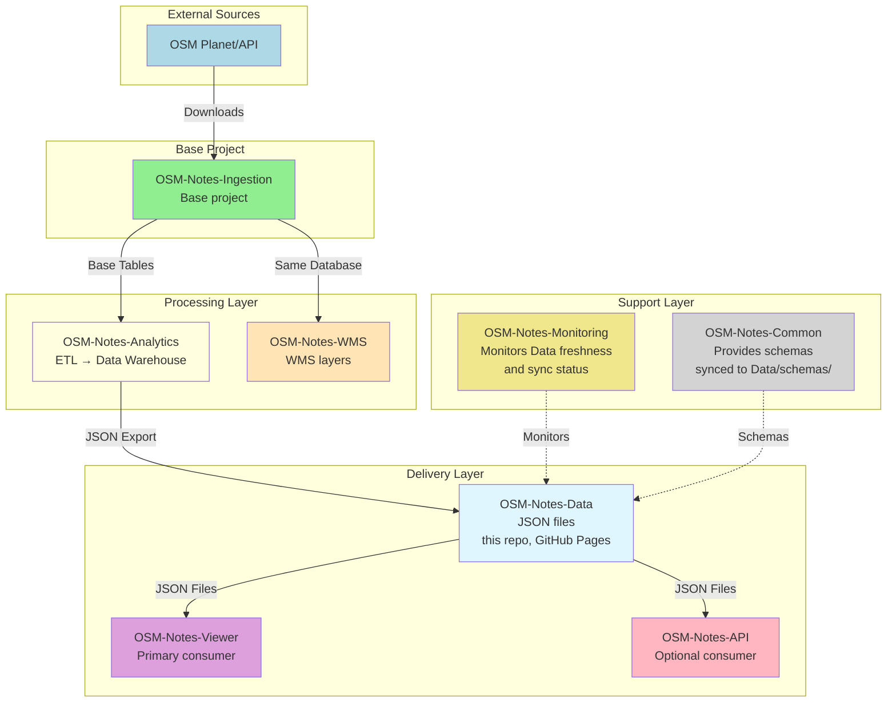
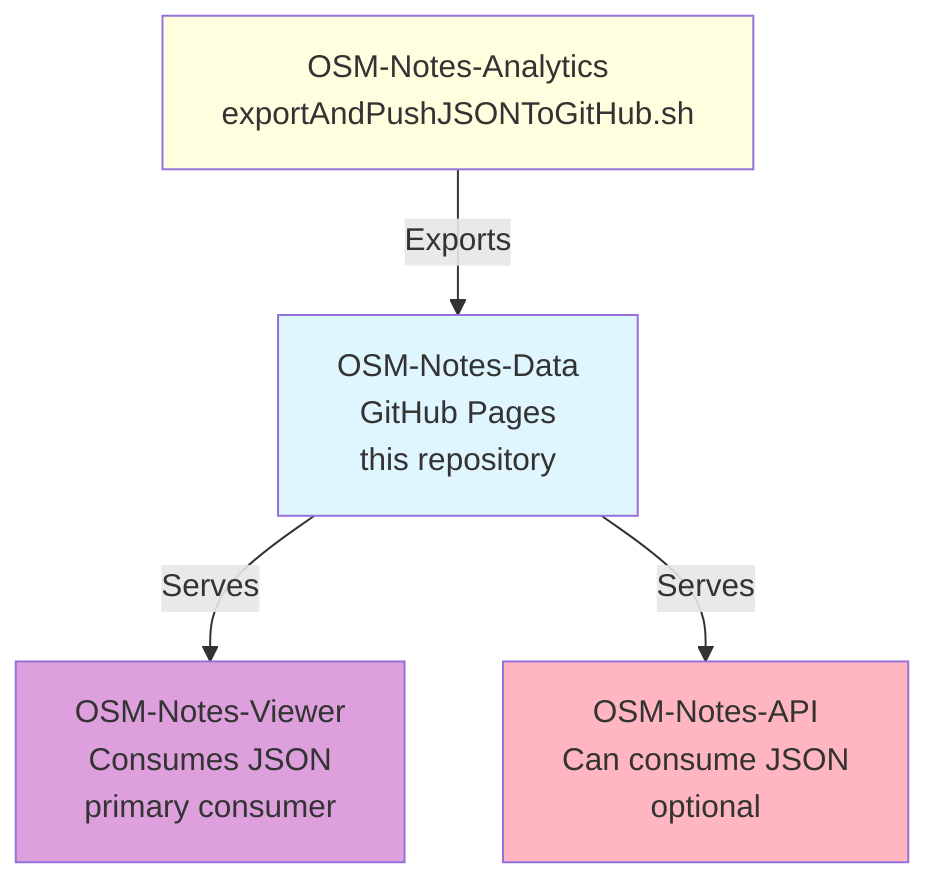

# OSM-Notes-Data

JSON data files for OSM Notes Viewer and AI-assisted note resolution.

This repository contains pre-calculated analytics data exported from the OSM Notes Analytics data warehouse, optimized for consumption by web viewers and AI systems.

## 📁 Repository Structure

### Data Files

#### User Data (`data/users/`)

Individual JSON files for each OpenStreetMap user, organized in a hexadecimal subdirectory structure for optimal filesystem performance:

- **Structure**: `data/users/{hex1}/{hex2}/{hex3}/{user_id}.json`
- **Example**: `data/users/0/3/2/421938.json`
- **Format**: Hexadecimal hash-based 3-level directory structure (modulo 4096)
- **Purpose**: Provides detailed statistics per user including:
  - Notes created, resolved, and commented
  - Application usage (mobile vs desktop)
  - Resolution metrics and response times
  - Historical data by year/month
  - Contributor type information

**Why subdirectories?** With hundreds of thousands of user files, organizing them in subdirectories improves:
- Filesystem performance (faster directory listings)
- GitHub UI navigation (no truncation)
- Scalability for future growth (millions of users)

#### Country Data (`data/countries/`)

Individual JSON files for each country:

- **Structure**: `data/countries/{country_id}.json`
- **Purpose**: Country-level statistics including:
  - Notes by country
  - Resolution rates and metrics
  - Application usage patterns
  - Temporal resolution data

#### Index Files (`data/indexes/`)

Quick lookup files for efficient data discovery:

- **`users.json`**: Array of all users with basic statistics (sorted by activity)
- **`countries.json`**: Array of all countries with basic statistics
- **Purpose**: Enables fast user/country discovery without loading individual files

#### Metadata (`data/metadata.json`)

Export metadata including:
- Export timestamp
- Total counts (users, countries, notes)
- Data version information

#### GeoJSON Files

- **`countries.geojson.gz`**: Compressed GeoJSON with country boundaries
- **`maritimes.geojson.gz`**: Compressed GeoJSON with maritime boundaries
- **Purpose**: Geographic data for map visualization

#### CSV Files (`csv/notes-by-country/`)

**Purpose**: Provide context to AI systems for note resolution assistance.

These CSV files contain notes organized by country, formatted to help AI models understand:
- Note content and context
- Geographic distribution
- Resolution patterns
- Historical data for training/context

**Use Case**: When an AI system needs to assist in resolving OpenStreetMap notes, these files provide the necessary context about:
- What types of notes exist in each country
- Common resolution patterns
- Geographic and cultural context
- Historical resolution data

Files are named by country ID: `{country_id}_{country_name}.csv`

#### Other Files

- **`noteLocation.csv.zip`**: Compressed CSV with note locations (lat/lon coordinates)
- **`schemas/`**: JSON Schema files for data validation (synced from OSM-Notes-Common)
  - Available via GitHub Pages at: `https://osm-notes.github.io/OSM-Notes-Data/schemas/`

## 🌐 Access via GitHub Pages

This repository is configured for GitHub Pages. Data files and schemas are accessible via:

**Data files:**
```
https://osm-notes.github.io/OSM-Notes-Data/data/{path}
```

**JSON Schemas:**
```
https://osm-notes.github.io/OSM-Notes-Data/schemas/{schema-name}.schema.json
```

See `index.html` for a complete list of available endpoints.

## 📊 Data Source

All data is exported from the OSM Notes Analytics data warehouse (`notes_dwh` database) using automated ETL processes. The export scripts are located in the [OSM-Notes-Analytics](https://github.com/OSM-Notes/OSM-Notes-Analytics) repository.

## 📚 Ecosystem Documentation

For shared documentation of the complete ecosystem, see:

- **[OSM Notes Ecosystem](https://github.com/OSM-Notes/OSM-Notes)** - Ecosystem landing page
- **[Global Glossary](https://github.com/OSM-Notes/OSM-Notes-Common/blob/main/docs/Glossary.md)** - Terms and definitions
- **[Complete Installation Guide](https://github.com/OSM-Notes/OSM-Notes-Common/blob/main/docs/Installation.md)** - Step-by-step installation of all projects
- **[End-to-End Data Flow](https://github.com/OSM-Notes/OSM-Notes-Common/blob/main/docs/Data_Flow.md)** - Complete data flow
- **[Decision Guide](https://github.com/OSM-Notes/OSM-Notes-Common/blob/main/docs/Decision_Guide.md)** - Which project do I need?

---

## 🌐 OSM-Notes Ecosystem

This Data repository is part of the **OSM-Notes ecosystem**, consisting of 8 interconnected projects.
**OSM-Notes-Ingestion is the base project** - it was the first created and provides the foundation
for all others. **This Data repository contains JSON files** automatically generated by Analytics and
served via GitHub Pages.

### Ecosystem Projects

1. **[OSM-Notes-Ingestion](https://github.com/OSM-Notes/OSM-Notes-Ingestion)** - **Base project**
   - Downloads and synchronizes OSM notes from Planet and API
   - Populates base PostgreSQL tables
   - First project created, foundation for all others

2. **[OSM-Notes-Analytics](https://github.com/OSM-Notes/OSM-Notes-Analytics)** ⚠️ **GENERATES THIS DATA**
   - ETL processes and data warehouse
   - Generates analytics and datamarts
   - **Exports to**: OSM-Notes-Data (this repository) via `exportAndPushJSONToGitHub.sh`
   - **Requires**: OSM-Notes-Ingestion (reads from base tables)

3. **[OSM-Notes-API](https://github.com/OSM-Notes/OSM-Notes-API)**
   - REST API for programmatic access
   - Provides dynamic queries and advanced features
   - **Requires**: OSM-Notes-Analytics (reads from data warehouse)
   - **Can also use**: OSM-Notes-Data (optional, reads JSON files)

4. **[OSM-Notes-Viewer](https://github.com/OSM-Notes/OSM-Notes-Viewer)** ⚠️ **PRIMARY CONSUMER**
   - Web application for interactive visualization
   - Consumes JSON data from OSM-Notes-Data (this repository, GitHub Pages)
   - **Requires**: OSM-Notes-Data (consumes JSON from GitHub Pages)

5. **[OSM-Notes-WMS](https://github.com/OSM-Notes/OSM-Notes-WMS)**
   - Web Map Service for geographic visualization
   - Publishes WMS layers for mapping applications
   - **Requires**: OSM-Notes-Ingestion (uses same database)
   - **Note**: WMS does not use Data (uses database directly)

6. **[OSM-Notes-Monitoring](https://github.com/OSM-Notes/OSM-Notes-Monitoring)**
   - Centralized monitoring and alerting
   - Monitors all ecosystem components including Data freshness
   - **Requires**: Access to all other projects' databases/services
   - **Monitors**: Data repository sync status, export timestamps, GitHub Pages availability

7. **[OSM-Notes-Common](https://github.com/OSM-Notes/OSM-Notes-Common)**
   - Shared Bash libraries and utilities
   - **Provides**: JSON Schema files (synced to `schemas/` directory in this repository)
   - **Used by**: Analytics (for validation during export), Data (schemas for validation)

8. **[OSM-Notes-Data](https://github.com/OSM-Notes/OSM-Notes-Data)** (this repository)
   - JSON data files exported from Analytics
   - Served via GitHub Pages
   - **Requires**: OSM-Notes-Analytics (generates and publishes the data)
   - **Consumed by**: Viewer (primary consumer), API (optional)
   - **No code**: This repository contains only data files, no executable code

### Project Relationships



### Data Flow



### Installation Order

When setting up the complete ecosystem, install projects in this order:

1. **OSM-Notes-Ingestion** - Install first (base project)
2. **OSM-Notes-Analytics** - Requires Ingestion
3. **OSM-Notes-WMS** - Requires Ingestion
4. **OSM-Notes-Data** (this repository) - Requires Analytics (auto-generated by Analytics export script)
5. **OSM-Notes-Viewer** - Requires Data (consumes JSON from GitHub Pages)
6. **OSM-Notes-API** - Requires Analytics (reads from Analytics data warehouse, can optionally use Data)
7. **OSM-Notes-Monitoring** - Requires all others (monitors them)
8. **OSM-Notes-Common** - Used as submodule (no installation needed, schemas synced to Data)

**Note**: This Data repository is automatically populated by Analytics. You don't need to manually install or configure it - Analytics handles the export and push process.

## Requirements

### Application Requirements

**None** - This repository contains only data files (JSON, GeoJSON, CSV) and does not require any application installation.

**For consumption**:
- **Web browser**: For accessing data via GitHub Pages
- **HTTP client**: For programmatic access to JSON files
- **GitHub Pages**: Automatically enabled for this repository

### Internal Repository Requirements

- **OSM-Notes-Analytics** ⚠️ **REQUIRED FOR DATA GENERATION**
  - Analytics generates and publishes JSON files to this repository via `exportAndPushJSONToGitHub.sh`
  - Analytics must be installed and configured before Data can be populated
  - **Installation order**: Analytics → Data (auto-generated)

**Note**: This repository does not require manual installation. It is automatically populated by Analytics export scripts. Consumers (Viewer, API) only need HTTP access to GitHub Pages.

## Recommended Reading Path

**New to this project?** Follow this reading path (~30 minutes):

### For Data Consumers

1. **Start Here** (10 min)
   - Read this README.md (you're here!)
   - Understand the repository structure
   - Review the Data Source section

2. **Accessing Data** (10 min)
   - Review "Access via GitHub Pages" section
   - Understand file structure and formats
   - Check available endpoints in `index.html`

3. **Data Formats** (10 min)
   - Review "File Formats" section
   - Understand JSON structure for users and countries
   - Review index files structure

**Total time: ~30 minutes** for understanding data access.

### For Developers (Data Generation)

1. **Data Generation** (20 min)
   - Review "Update Process" section below
   - Understand how Analytics exports data
   - Review JSON Schema validation

2. **Integration** (10 min)
   - Understand how Viewer consumes this data
   - Review data contract with Analytics
   - Check schema files in `schemas/` directory

**Total time: ~30 minutes** for understanding data generation.

## Entry Points

**Main entry points** for accessing and using Data:

### HTTP Entry Points (GitHub Pages)

**Base URL**: `https://osm-notes.github.io/OSM-Notes-Data/`

1. **User Profile Data**
   ```
   https://osm-notes.github.io/OSM-Notes-Data/data/users/{hex1}/{hex2}/{hex3}/{user_id}.json
   ```
   Example: `https://osm-notes.github.io/OSM-Notes-Data/data/users/0/3/2/421938.json`

2. **Country Profile Data**
   ```
   https://osm-notes.github.io/OSM-Notes-Data/data/countries/{country_id}.json
   ```
   Example: `https://osm-notes.github.io/OSM-Notes-Data/data/countries/42.json`

3. **Index Files**
   ```
   https://osm-notes.github.io/OSM-Notes-Data/data/indexes/users.json
   https://osm-notes.github.io/OSM-Notes-Data/data/indexes/countries.json
   ```

4. **Metadata**
   ```
   https://osm-notes.github.io/OSM-Notes-Data/data/metadata.json
   ```

5. **GeoJSON Files**
   ```
   https://osm-notes.github.io/OSM-Notes-Data/data/countries.geojson.gz
   https://osm-notes.github.io/OSM-Notes-Data/data/maritimes.geojson.gz
   ```

6. **JSON Schemas**
   ```
   https://osm-notes.github.io/OSM-Notes-Data/schemas/user-profile.schema.json
   https://osm-notes.github.io/OSM-Notes-Data/schemas/country-profile.schema.json
   ```

7. **CSV Files** (for AI context)
   ```
   https://osm-notes.github.io/OSM-Notes-Data/csv/notes-by-country/{country_id}_{country_name}.csv
   ```

8. **Complete Endpoint List**
   ```
   https://osm-notes.github.io/OSM-Notes-Data/index.html
   ```

### Data Generation Entry Points

**Note**: Data is automatically generated by OSM-Notes-Analytics. These are the entry points in the Analytics repository:

1. **Export Datamarts to JSON** (in OSM-Notes-Analytics)
   ```bash
   # In OSM-Notes-Analytics repository
   ./bin/dwh/exportDatamartsToJSON.sh
   ```

2. **Copy to Data Repository** (after export)
   ```bash
   # Copy exported files to OSM-Notes-Data repository
   cp -r output/json/* /path/to/OSM-Notes-Data/data/
   ```

### Local Development Entry Points

1. **Clone Repository** (for local access)
   ```bash
   git clone https://github.com/OSM-Notes/OSM-Notes-Data.git
   cd OSM-Notes-Data
   ```

2. **Serve Locally** (for testing)
   ```bash
   # Using Python
   python3 -m http.server 8000
   
   # Using Node.js
   npx http-server -p 8000
   ```
   Then access: `http://localhost:8000/data/...`

### Validation Entry Points

1. **Validate JSON Schemas** (using AJV CLI)
   ```bash
   # Install AJV CLI
   npm install -g ajv-cli
   
   # Validate user profile
   ajv -s schemas/user-profile.schema.json -d data/users/0/3/2/421938.json
   
   # Validate country profile
   ajv -s schemas/country-profile.schema.json -d data/countries/42.json
   ```

## 🔄 Update Process

Data is automatically updated via scheduled exports that:
1. Extract modified data from the data warehouse
2. Export to JSON files
3. Validate against JSON schemas
4. Commit and push to this repository
5. Deploy via GitHub Pages

## 📝 File Formats

- **JSON**: All user, country, and index data
- **GeoJSON**: Geographic boundaries (compressed with gzip)
- **CSV**: Note data for AI context (organized by country)
- **Schemas**: JSON Schema for validation

## 🔗 Related Projects

For complete information about the OSM-Notes ecosystem and all 8 projects, see the
[OSM-Notes Ecosystem](#-osm-notes-ecosystem) section above.

**Key relationships:**
- **[OSM-Notes-Analytics](https://github.com/OSM-Notes/OSM-Notes-Analytics)**: ⚠️ **Generates this data** - Data warehouse and ETL processes that export JSON files to this repository
- **[OSM-Notes-Viewer](https://github.com/OSM-Notes/OSM-Notes-Viewer)**: ⚠️ **Primary consumer** - Web viewer that consumes JSON data from this repository
- **[OSM-Notes-API](https://github.com/OSM-Notes/OSM-Notes-API)**: Optional consumer - Can read JSON files from this repository (also reads from Analytics DWH)
- **[OSM-Notes-Common](https://github.com/OSM-Notes/OSM-Notes-Common)**: Provides JSON schemas (synced to `schemas/` directory)

**Other ecosystem projects:**
- [OSM-Notes-Ingestion](https://github.com/OSM-Notes/OSM-Notes-Ingestion) - Base project (provides data to Analytics)
- [OSM-Notes-WMS](https://github.com/OSM-Notes/OSM-Notes-WMS) - WMS service (doesn't use Data)
- [OSM-Notes-Monitoring](https://github.com/OSM-Notes/OSM-Notes-Monitoring) - Monitors Data freshness

## GDPR Compliance

**Important:** This repository contains data files that may include personal information from OpenStreetMap, including usernames and geographic locations. We are committed to GDPR compliance.

GDPR compliance mechanisms are implemented in the base project **OSM-Notes-Ingestion**. For detailed information about GDPR compliance, data processing, retention, and data subject rights, please refer to:

- **GDPR Privacy Policy:** [OSM-Notes-Ingestion/docs/GDPR_Privacy_Policy.md](https://github.com/OSM-Notes/OSM-Notes-Ingestion/blob/main/docs/GDPR_Privacy_Policy.md)
- **GDPR Procedures:** [OSM-Notes-Ingestion/docs/GDPR_Procedures.md](https://github.com/OSM-Notes/OSM-Notes-Ingestion/blob/main/docs/GDPR_Procedures.md) - Procedures for handling data subject requests

This Data repository contains exported data that originates from OSM-Notes-Ingestion (via OSM-Notes-Analytics) and is subject to the same GDPR compliance measures.

## 📄 License

See [LICENSE](LICENSE) file for details.
